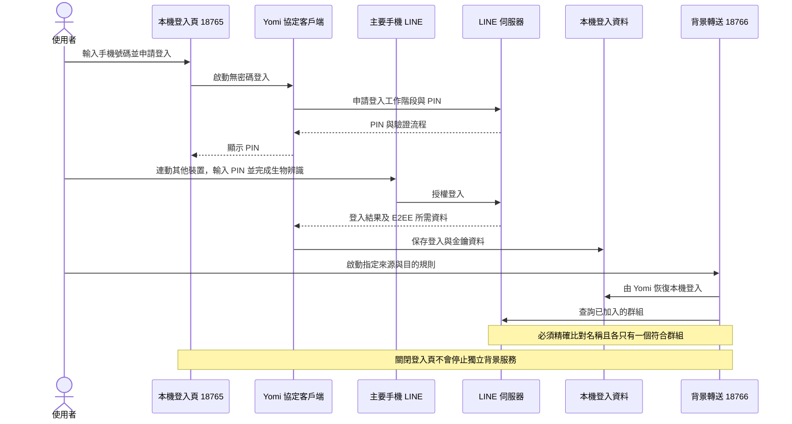
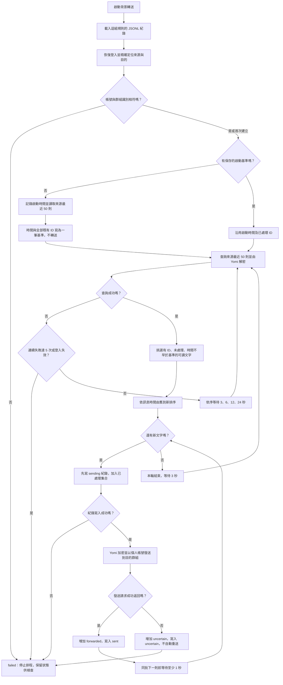
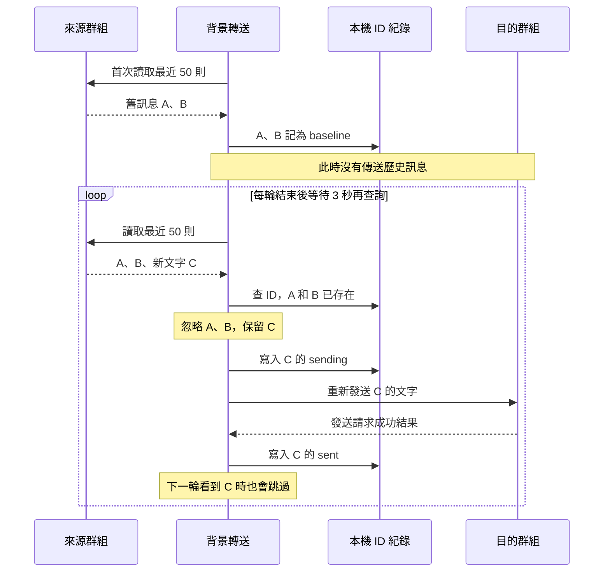

# LINE Relay Bridge｜LINE 訊息橋

Windows 上執行的 LINE 一般群組文字轉送原型。使用自己的 LINE 帳號登入，來源群組不需加入 Bot；透過 Yomi 讀取近期訊息並轉送，不需要 AI，也不操作滑鼠鍵盤。

目前是原始碼測試版，沒有安裝檔。已實測登入、群組列表、文字解密，以及「來源1 → 目的2」單次傳送後讀回核對。背景監控已啟動並確認輪詢成功；尚未完成長時間穩定性驗證。

**第一次使用：**[安裝教學](docs/INSTALL.md) → [使用、測試與更新](docs/USAGE.md)。發生問題請看 [疑難排解](docs/TROUBLESHOOTING.md)；程式安全檢查、已修正問題與剩餘限制見 [SECURITY.md](SECURITY.md)。

目前支援：Windows 11、一個個人帳號、一組「一般群組 → 一般群組」、可讀文字。尚未支援 LINE 社群（OpenChat）、Telegram、關鍵字篩選、多來源與完整訊息封存。名稱暫沿用 LINE Relay Bridge，尚未定案。

## 原理與動態流程

這是一個使用個人帳號的非官方 LINE 協定客戶端。Yomi 負責向 LINE 伺服器完成登入、查詢聊天與訊息，以及 E2EE（端對端加密）解密／加密；本專案負責排程、篩選新訊息、記錄處理結果及轉送。手機授權後，程式使用保存於本機的登入工作階段。來源和目的群組都必須是該帳號已加入的群組。

它不使用 LINE Messaging API、官方帳號 Webhook、螢幕 OCR 或 AI。來源群組不會增加 Bot 成員，但 LINE 伺服器仍會接收到登入、查詢與發訊請求；「沒有 Bot 成員」不代表平台無法識別自動化。目的群組看到的發訊者是你的個人帳號，文字是重新發送，並非保留原發訊人身分的原生轉傳。

GitHub 的 README 支援 Mermaid 流程與時序圖，但不執行 JavaScript 動畫。以下圖解呈現實際運作分支；另附 [可逐步播放的互動流程示範](docs/flow.html)，下載專案後用瀏覽器開啟即可播放。示範只使用模擬訊息，不會登入或發送 LINE 訊息。

### 1. 登入與背景服務分工



### 2. 首次基準與每輪新訊息判斷



圖中的紀錄寫入若失敗都會停止排程，包括 sent／uncertain 的寫入。登入、名稱比對及首次基準建立失敗也會進入 failed，需處理問題後重新啟動。讀取錯誤採逐步退避，第 5 次連續失敗停止；沒有自動重新登入。發送回應必須包含訊息 ID，否則視為結果不明並停止。

### 3. 為什麼不會反覆轉傳歷史訊息？



| 情況 | 實際處理 |
| --- | --- |
| 相同文字、不同 ID | 視為兩則不同訊息，兩則都轉送 |
| 解密失敗／沒有文字 | 不轉送；沒有記為已處理，日後若可讀仍可嘗試 |
| 寫入 sending 後程序中斷 | 重啟不重送該 ID；可能因此漏送 |
| 發送逾時或錯誤 | 無法確認遠端是否收到，標示 uncertain，停止轉送且不自動重送 |
| 重啟同一規則 | 沿用紀錄，可處理仍位於最近 50 則內的未處理訊息 |
| 初次查詢基準期間收到的訊息 | 若包含在基準快照內，也會被排除；建議等 running 再測試 |
| 兩輪間超過 50 則新訊息 | 超出視窗的訊息可能漏掉，目前沒有完整補抓 |

這是「定期查詢＋訊息 ID 去重」，並非伺服器主動推送新訊息。3 秒是每輪結束後的等待時間，不是固定送達時限；查詢、加密、發送及訊息數量都會增加延遲。forwarded 表示發送介面成功返回，不代表所有接收者已讀，也不是每一則都已讀回驗證。

## LINE 帳號限制與封號風險

**存在風險，不能保證不封號，也沒有可靠資料可估算機率。**本工具透過非官方客戶端自動使用個人帳號，手機授權成功並不代表 LINE 已核准此自動化用途。

查核日期：2026-10-08。[LY Corporation 通用服務條款](https://terms.line.me/line_terms?lang=zh-Hant)第 15(5) 項禁止使用 bots 或其他技術手段不當操作服務；第 17 節規定違反條款等情況下可限制服務或刪除帳號。[LINE 官方使用限制說明](https://help.line.me/line/smartphone?contentId=200002135&lang=zh-Hant)表示可能限制部分功能或帳號，且不公開具體判定標準。這些文件提供風險依據，並非宣告每個非官方客戶端都必然被封號。

依上述政策與本程式行為判斷：持續自動查詢及發訊可能被平台判定為不當操作；群組中不出現 Bot 不能消除此風險。小量測試成功不代表長期安全，降低頻率也不是免封保證。目前已加入發訊間隔、讀取退避及錯誤停止，但這些不是可靠的封鎖偵測，也不是免封措施。若出現功能限制或異常驗證，應停止背景程序，確認官方帳號狀態，不要反覆重試。請勿用無法承受停用損失的主要帳號做長期測試；轉送內容也需取得適當授權。

## 環境與啟動

需求：Windows 11、Node.js 與 npm（開發實測 Node.js 26.4.0）、已登入 LINE 的主要手機。每位使用者需自行授權登入，不共用登入資料。

```powershell
cd yomi-probe
npm ci --ignore-scripts
npm test
npm start
```

1. 開啟 http://127.0.0.1:18765/，輸入自己的手機號碼，依頁面指示在手機 LINE 授權。
2. 讀取群組列表，選擇群組並確認文字可讀；支援表情符號群名。
3. 選擇來源、目的群組，分別從完整群名欄位複製名稱（包含 emoji）。程式要求每個名稱只有一個符合群組，避免傳錯。
4. 在專案根目錄雙擊 `啟動自動轉送.cmd`，或於 yomi-probe 執行下列指令：

```powershell
powershell -NoProfile -ExecutionPolicy Bypass -File .\start-relay.ps1 -Interactive
```

5. 依提示貼上來源與目的名稱。查看 http://127.0.0.1:18766/status，確認 phase 為 running，再於來源發新文字，觀察目的是否收到。

也可指定任意已加入的一般群組，不必修改程式碼：

```powershell
powershell -NoProfile -ExecutionPolicy Bypass -File .\start-relay.ps1 -SourceName "來源群組名稱" -DestinationName "目的群組名稱"
```

群組名稱必須完整吻合（含表情符號），且不能重名。切換規則前執行 `stop-relay.ps1` 停止原服務；同時只執行一組規則。每組來源／目的使用獨立去重紀錄，並驗證帳號與群組 ID 的識別雜湊。尚未提供圖形化轉送設定。

## 自動轉送行為

- 每次查詢完成後等待 3 秒再讀取來源最近 50 則，依時間排序，只轉送未處理的可讀文字。
- 第一次啟動將目前近期訊息設為基準，不回傳歷史訊息。後續重啟沿用本機基準及紀錄，可補處理最近 50 則內的未處理訊息。
- 以訊息 ID 去重；相同文字、不同訊息 ID 仍會轉送。
- 傳送前寫入紀錄，避免程序中斷或網路結果不明時重複發送。結果不明的訊息不自動重試，因此可能漏訊；不是保證恰好一次送達。
- 目的訊息由登入的個人帳號發送。未支援 Telegram、圖片、LINE 社群（OpenChat）、條件篩選或多來源規則。
- 可關閉收訊網頁；背景程序會繼續執行。電腦需不休眠、不登出且保持網路。沒有開機自啟動；停止方式見 [使用教學](docs/USAGE.md)。
- `test-relay.mjs --send-latest` 是會實際傳送一則來源最新歷史文字的手動測試程式；日常測試不需要執行。

## 資料與限制

登入資料由 Yomi 保存於 `%LOCALAPPDATA%\LineCallYomiProbe`。啟動時收緊 Windows 存取權限，但檔案內容未加密；不可分享、提交 Git 或放入安裝包。預設規則紀錄為 `relay-source1-destination2.jsonl`，自訂規則為 `relay-<規則雜湊>.jsonl`，只含訊息 ID、基準、識別雜湊與結果；不是完整訊息備份。網頁最多保留 5,000 則在記憶體，需手動匯出。詳見 [安全限制](SECURITY.md)。

使用非官方 LINE 協定。LINE 更新可能使登入或收發失效，登入可能讓官方電腦版 LINE 登出。大量新訊息超過最近 50 則、網路錯誤或休眠可能漏訊，不能保證他人不察覺轉送。

## 專案結構

| 路徑 | 用途 |
| --- | --- |
| `yomi-probe/` | 現行登入頁、收訊驗證、背景轉送與測試 |
| `yomi-probe/VERIFICATION.md` | 實際驗證紀錄與未驗證項目 |
| `src/`、`scripts/`、`package/` | 早期 Windows 通知與 OCR 診斷工具，非目前轉送服務 |
| `NOTIFICATION_DIAGNOSTICS.md` | 早期工具說明，含開發環境歷史紀錄 |
| `THIRD_PARTY_NOTICES.md` | 原始專案、官方文件與第三方授權參考 |

## 參考來源與授權

核心依賴 [RikaiDev/yomi](https://github.com/RikaiDev/yomi)，固定使用 `@rikaidev/yomi` 0.5.0（MIT，Copyright 2026 RikaiDev）。本專案自行實作頁面與轉送邏輯，並非 LINE 或 Yomi 官方產品。完整來源列於 [THIRD_PARTY_NOTICES.md](THIRD_PARTY_NOTICES.md)。本專案自有程式採 [MIT License](LICENSE)，第三方依賴遵循其各自授權。
