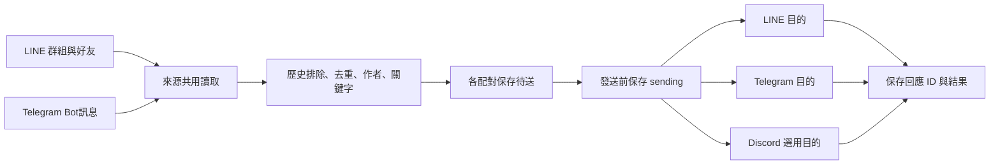

# LinePort

在 Windows 背景轉送 LINE 與 Telegram 訊息。支援多來源、多目的、指定發訊者、內容篩選及選用的 Discord 文字目的。

v0.8.0 可勾選 LINE 已加入成員、查看每個來源的指定人員摘要，並選用 Telegram → LINE 圖片轉送。三來源／四目的的限流、不明結果與重啟隔離已補上測試；148 項測試通過。[本次更新](docs/RELEASE-0.8.0.md)

[下載 v0.8.0 ZIP](https://github.com/b40609/LinePort/releases/download/v0.8.0/LinePort-v0.8.0.zip) · [更新與 SHA-256](docs/RELEASE-0.8.0.md) · [使用教學](docs/USAGE.md) · [多來源與篩選](docs/ROUTING.md) · [支援範圍](docs/DEVELOPMENT-STATUS.md) · [安全說明](SECURITY.md) · [交接](HANDOFF.md)

[手機示範畫面](https://raw.githubusercontent.com/b40609/LinePort/v0.7.2/docs/assets/preview-mobile-0.7.jpg)（v0.7.2 歷史畫面；名稱、ID、訊息均為假資料）。

## 功能

- **多來源、多目的**：每個來源轉到所有選取目的；可建立多條規則，分別啟用或暫停。
- **跨平台**：LINE／Telegram 可轉送到 LINE、Telegram 或選用 Discord 一般文字頻道；Discord 只作目的。
- **群組與個人**：LINE 已加入群組與好友；Telegram Bot 可存取的群組、頻道與私訊。
- **文字篩選**：包含／排除關鍵字、加上訊息前綴。
- **指定發訊者**：每個來源各選固定發訊者 ID；LINE 可勾選已加入成員，Telegram 列最近發訊者。名稱改變不影響，貼圖不轉送。搭配訊息關鍵字排除純寒暄。
- **選用時段與媒體**：台北時段外明確保留待送或略過；Telegram → Telegram 圖片／檔案；Telegram → LINE 支援 JPEG／PNG 圖片，說明另送。
- **管理與保護**：規則搜尋、複製為暫停規則、各來源文字／媒體模擬、安全診斷、設定備份還原、容量監控及保留原檔的私人封存與 SHA-256 驗證。
- **選用回覆關聯**：引用同路線已確認送達的原訊息，重啟保留對照；缺少對照時送一般訊息，不補送被篩掉的原訊息。
- **獨立狀態**：各來源讀取診斷，各配對待送、成功與略過數；一個目的受阻時，其他配對繼續。
- **保存與去重**：首次略過歷史，同一規則重啟沿用紀錄；以平台與聊天室 ID 辨識，同名群組可分開選。
- **LINE 補讀**：近期 50 則不足時，分頁查詢；最多 1,000 則，無法追到基準時顯示錯誤。
- **安全預覽**：LINE 最近訊息與 JSON 匯出，不負責發送。
- **LINE 已讀行為實測**：本次三則文字轉送皆收到、來源已讀維持 0；同帳號用官方 LINE 開啟來源後變成 1。可讓來源閱讀操作留給使用者；結果限本次版本與條件。[測試過程、對照與限制](docs/READ-RECEIPT-2026-10-10.md)

| 項目 | 支援範圍 |
| --- | --- |
| 系統 | Windows 11；實測 Node.js 26.4.0 |
| LINE | 非官方個人帳號協定；已加入的一般群組、好友私訊 |
| Telegram | 官方 Bot API；Bot 有權限讀取／發送的聊天室 |
|訊息 | 可讀純文字；選用 Telegram → Telegram 圖片／檔案、Telegram → LINE 圖片；目的仍以本工具帳號發送 |
| 規則上限 | 30 條；每條 1–10 個來源、1–10 個目的；合計最多 100 組啟用配對 |
| 未支援 | LINE 社群 OpenChat、Slack、Discord 來源、LINE 來源附件、LINE 目的檔案、貼圖、相簿整組／影音、編輯／刪除同步、完整聊天封存 |

## 快速開始

安裝 [Node.js](https://nodejs.org/)，下載並解壓縮本專案。在專案目錄開啟 PowerShell：

```powershell
cd yomi-probe
npm.cmd ci --ignore-scripts
npm.cmd start
```

開啟 http://127.0.0.1:18765/：

1. 使用 LINE 時，完成手機授權或恢復登入，按「載入 LINE 群組與好友」。
2. 使用 Telegram 時，在頁面連結並保存自己的 Bot Token，再載入 Bot 聊天室或手動加入 ID。
3. 選取來源與目的，按住 Ctrl 可多選，按「新增並保存規則」。
4. 按「開始轉送」，等基準完成後，在來源發新文字確認目的收到。

只使用 Telegram 時不必登入 LINE。Telegram 來源是 Bot 可收到的訊息，並非登入個人 Telegram 帳號讀取所有聊天。電腦需保持連網、不休眠。

[安裝教學](docs/INSTALL.md) · [Telegram 權限與設定](docs/USAGE.md#telegram) · [舊版更新](docs/USAGE.md#更新)

## 運作方式

LINE 透過 [Yomi](https://github.com/RikaiDev/yomi) 讀取／解密及加密發送；Telegram 使用 [官方 Bot API](https://core.telegram.org/bots/api)。本專案負責規則、輪詢、篩選與保存，不需要 AI。



各來源與待送佇列分開輪詢，完成後等待 3 秒；同一目的依序發送，間隔至少 1.1 秒。來源讀取失敗採退避重試；Telegram／Discord 明確限流保存等待期限，其他發送結果不明則持續暫停該配對，重啟也不自動重送。重複配對、自我轉送與規則循環會被阻擋；工具自己送出的訊息另保存 ID，避免再次接力轉送。

## 使用限制

- LINE 使用非官方個人帳號協定，有功能限制或停權風險；登入可能使官方電腦版 LINE 登出。[LINE 條款](https://terms.line.me/line_terms?lang=zh-Hant)
- 目的訊息由登入 LINE 帳號或 Telegram Bot 重新發送，不保留原發訊者身分。
- 休眠、斷線、查詢上限、首次基準與發送結果不明皆可能造成漏訊，沒有完整送達保證。
- Telegram 受 Bot 權限、隱私模式、其他輪詢程序與 Webhook 影響；受保護內容及 Bot訊息不轉送。
- Bot Token 可選 Windows DPAPI；舊明文檔為回復保留，LINE 登入／E2EE、訊息與封存仍未加密。勿分享或雲端同步資料目錄。
- 單一紀錄 16 MiB、盤點紀錄合計 256 MiB 或可用空間低於 64 MiB 時停止收件／發送。封存不刪原檔、不釋放容量；尚無自動壓縮與無限期運作保證。

已完成一次 LINE → LINE 人工驗收，共三則文字轉送與已讀正向對照；多目的、跨平台及長時間運作仍待真實驗收。[已讀實測](docs/READ-RECEIPT-2026-10-10.md) · [驗證紀錄](yomi-probe/VERIFICATION.md)

## 開發與文件

```powershell
cd yomi-probe
npm.cmd test
```

測試使用模擬服務，不讀取真實登入資料、不發真實 LINE／Telegram訊息。介面模擬可執行 `node ui-mock.mjs`，使用 18767 埠。

[疑難排解](docs/TROUBLESHOOTING.md) · [架構](docs/ARCHITECTURE.md) · [安全](SECURITY.md)

現行程式位於 `yomi-probe/`。`src/`、`scripts/`、`package/` 為早期 Windows 通知診斷實驗。[早期單配對流程示範](docs/flow.html) 保留作參考。

## 授權

[MIT License](LICENSE)。核心依賴 `@rikaidev/yomi` 0.5.0，MIT，Copyright 2026 RikaiDev；見 [第三方聲明](THIRD_PARTY_NOTICES.md)。本工具與 LINE、Yomi 無官方關係。
