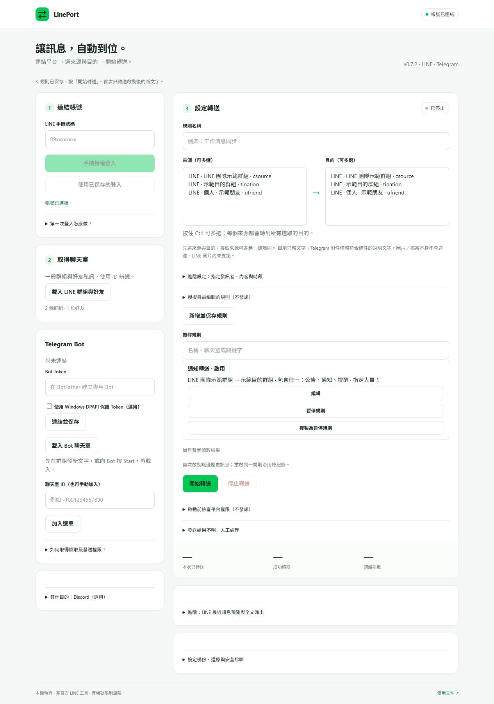
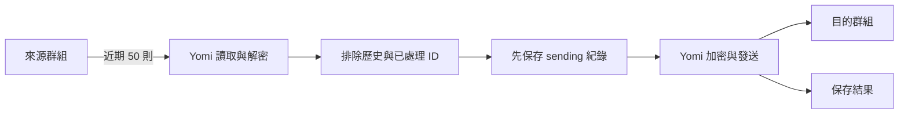

# LinePort

在 Windows 背景轉送 LINE 一般群組的新文字訊息。使用個人帳號，來源群組不需加入 Bot，不占用滑鼠或鍵盤。

[快速開始](#快速開始) · [使用教學](docs/USAGE.md) · [運作原理](docs/ARCHITECTURE.md) · [安全說明](SECURITY.md)



畫面使用示範資料。

## 功能

- **群組選單**：讀取已加入的群組，直接選擇來源與目的，支援 emoji。
- **背景轉送**：從網頁啟動、停止及查看狀態；關閉網頁仍持續執行。
- **歷史排除**：首次啟動建立基準，依訊息 ID 去重；重啟沿用處理紀錄。
- **訊息預覽**：查看最近 50 則訊息，匯出本次預覽為 JSON。

| 項目 | 支援範圍 |
| --- | --- |
| 平台 | Windows 11；實測 Node.js 26.4.0 |
| 來源與目的 | LINE 一般群組 → LINE 一般群組 |
| 內容 | 可解密的文字；單帳號、單組轉送規則 |
| 未支援 | OpenChat、Telegram、圖片、條件篩選、多來源、完整聊天封存 |

## 快速開始

安裝 [Node.js](https://nodejs.org/)，下載本專案並解壓縮。在專案目錄開啟 PowerShell：

```powershell
cd yomi-probe
npm.cmd ci --ignore-scripts
npm.cmd start
```

1. 開啟 http://127.0.0.1:18765/，按「手機授權登入」；已有登入資料則按「使用已保存的登入」。
2. 在手機 LINE 完成授權，按「載入群組列表」。
3. 選擇來源與目的，按「開始轉送」。
4. 等狀態顯示「轉送中」，在來源發一則新文字，確認目的收到。

來源與目的必須是帳號已加入、名稱不重複的不同群組。電腦需持續連網且不休眠。詳細步驟見 [安裝教學](docs/INSTALL.md)；舊版使用者請先看 [更新方式](docs/USAGE.md#更新)。

## 運作方式

透過 [Yomi](https://github.com/RikaiDev/yomi) 的非官方 LINE 協定恢復登入、讀取／解密與發訊。本專案負責輪詢、去重及保存處理結果，不需要 AI。



每輪完成後等待 3 秒；同批發訊間隔至少 1 秒。發送結果不明時停止，不自動重送。詳細時序、失敗分支與重啟行為見 [架構文件](docs/ARCHITECTURE.md)。下載後可開啟 [互動流程示範](docs/flow.html) 逐步播放；GitHub 不執行 HTML 動畫。

## 使用限制

- 非官方個人帳號自動化有功能限制或停權風險，不能保證不封號。來源沒有 Bot 成員不代表平台無法偵測。[LINE 條款](https://terms.line.me/line_terms?lang=zh-Hant)
- 目的訊息由登入帳號重新發送；不保留原發訊者身分。登入可能使官方電腦版 LINE 登出。
- 最近 50 則視窗、斷線、休眠與結果不明皆可能造成漏訊；目前沒有完整送達保證。
- 登入與 E2EE 資料保存在 `%LOCALAPPDATA%\LineCallYomiProbe`，限制 Windows 存取權限但未加密。不要分享或雲端同步此目錄。[安全說明](SECURITY.md)

## 開發與文件

```powershell
cd yomi-probe
npm.cmd test
```

測試使用模擬服務，不讀取真實登入資料、不對 LINE 發訊。

[安裝](docs/INSTALL.md) · [使用與更新](docs/USAGE.md) · [疑難排解](docs/TROUBLESHOOTING.md) · [架構](docs/ARCHITECTURE.md) · [驗證紀錄](yomi-probe/VERIFICATION.md)

現行程式位於 `yomi-probe/`。`src/`、`scripts/`、`package/` 為早期 Windows 通知診斷實驗，不屬於目前轉送流程。

## 授權

本專案採 [MIT License](LICENSE)。核心依賴 `@rikaidev/yomi` 0.5.0，MIT，Copyright 2026 RikaiDev；完整來源見 [第三方聲明](THIRD_PARTY_NOTICES.md)。本工具與 LINE、Yomi 無官方關係。
