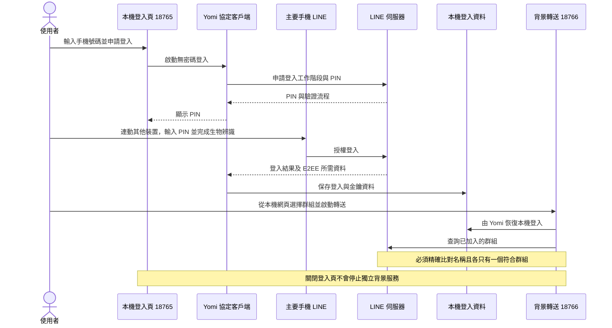
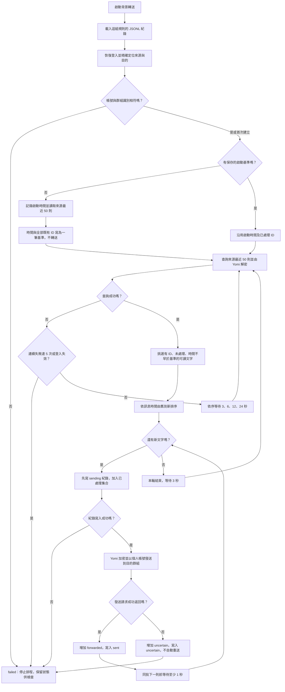
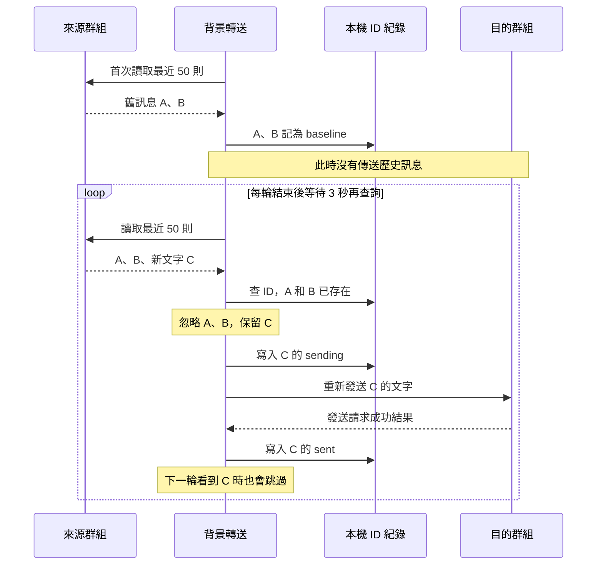

# 運作原理

這是一個使用個人帳號的非官方 LINE 協定客戶端。Yomi 負責向 LINE 伺服器完成登入、查詢聊天與訊息，以及 E2EE（端對端加密）解密／加密；本專案負責排程、篩選新訊息、記錄處理結果及轉送。手機授權後，程式使用保存於本機的登入工作階段。來源和目的群組都必須是該帳號已加入的群組。

它不使用 LINE Messaging API、官方帳號 Webhook、螢幕 OCR 或 AI。來源群組不會增加 Bot 成員，但 LINE 伺服器仍會接收到登入、查詢與發訊請求；「沒有 Bot 成員」不代表平台無法識別自動化。目的群組看到的發訊者是你的個人帳號，文字是重新發送，並非保留原發訊人身分的原生轉傳。

GitHub 支援 Mermaid 圖表；[互動流程示範](flow.html) 可下載後用瀏覽器播放，使用模擬訊息。

### 1. 登入與背景服務分工

### 2. 首次基準與每輪新訊息判斷

圖中的紀錄寫入若失敗都會停止排程，包括 sent／uncertain 的寫入。登入、名稱比對及首次基準建立失敗也會進入 failed，需處理問題後重新啟動。讀取錯誤採逐步退避，第 5 次連續失敗停止；沒有自動重新登入。發送回應必須包含訊息 ID，否則視為結果不明並停止。

### 3. 為什麼不會反覆轉傳歷史訊息？

| 情況 | 實際處理 |
| --- | --- |
| 相同文字、不同 ID | 視為兩則不同訊息，兩則都轉送 |
| 解密失敗／沒有文字 | 不轉送；沒有記為已處理，日後若可讀仍可嘗試 |
| 寫入 sending 後程序中斷 | 重啟不重送該 ID；可能因此漏送 |
| 發送逾時或錯誤 | 無法確認遠端是否收到，標示 uncertain，停止轉送且不自動重送 |
| 重啟同一規則 | 沿用紀錄，可處理仍位於最近 50 則內的未處理訊息 |
| 初次查詢基準期間收到的訊息 | 若包含在基準快照內，也會被排除；建議等 running 再測試 |
| 兩輪間超過 50 則新訊息 | 超出視窗的訊息可能漏掉，目前沒有完整補抓 |

這是「定期查詢＋訊息 ID 去重」，並非伺服器主動推送新訊息。3 秒是每輪結束後的等待時間，不是固定送達時限；查詢、加密、發送及訊息數量都會增加延遲。forwarded 表示發送介面成功返回，不代表所有接收者已讀，也不是每一則都已讀回驗證。
