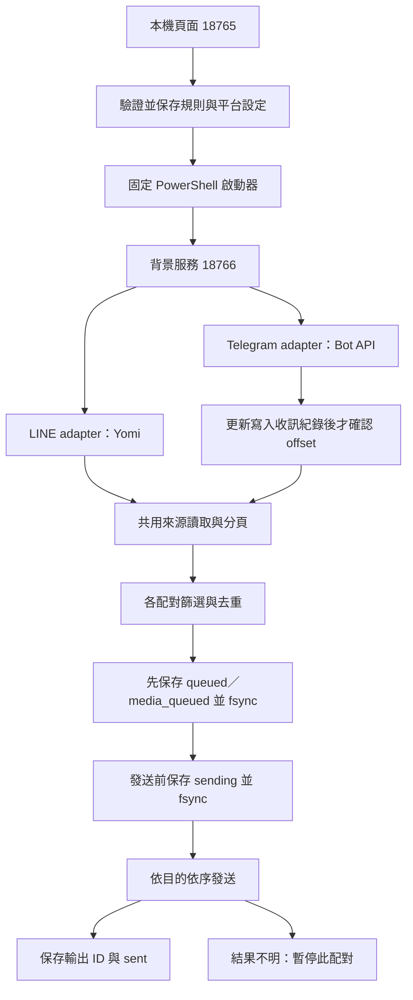

# 運作原理

v0.6.0 將來源讀取、持久待送與目的發送分開。LINE 使用 Yomi 非官方個人帳號協定；Telegram 使用官方 Bot API 長輪詢；Discord 只作官方 REST 文字目的。新增作者、時段與 Telegram 媒體選項預設關閉或不限制。

## 服務與介面

18765 管理登入、規則、Telegram 設定與 LINE 預覽；18766 是獨立背景程序，關閉網頁不停止。啟動器驗證版本 3、設定摘要與就緒狀態，避免沿用其他規則。修改設定前必須停止。

LINE 來源／目的限定已加入的一般群組及好友，不支援 OpenChat。Telegram 使用 Bot 身分，不登入使用者的個人帳號。目的文字由 LINE 帳號或 Bot 重新發送，不保留原發訊者身分。

## 規則與識別

每條規則保存穩定 ID，包含多個來源、目的、每來源作者白名單、關鍵字、前綴及選用時段／媒體。所有來源乘以所有目的形成獨立配對。以平台與聊天室 ID 辨識，不依名稱定位。

配對紀錄識別包含規則 ID、兩端帳號身分與來源／目的 ID。改名稱沿用同一紀錄；新增規則或更換端點／帳號採新識別與基準。舊版按名稱建立的單配對紀錄不自動遷移。

啟用規則驗證重複邊與有向循環，阻擋 A → B → A；自己成功送出的訊息 ID 另存至輸出紀錄，避免它在下游來源再次轉送。這不會識別其他帳號或外部工具重新貼上的相同文字。

## 來源讀取與首次基準

首次讀取快照內的歷史 ID 與基準時間一次保存並同步到磁碟，不發送；重啟載入基準與既有已處理 ID。首次快照期間出現的文字若已在快照內，也略過。

同一 LINE 來源每輪只讀一次，供全部配對共用。最近 50 則不足時，利用公開的前一頁介面繼續查詢，最多 20 頁／1,000 則。查到各配對共用的已處理位置、舊於基準或資料結束才停；游標不前進、缺少游標或超過上限會報錯，避免悄悄截斷。

Telegram 由獨立長輪詢讀取更新。保存選定來源可轉的文字及圖片／檔案資訊；受保護、付費、限時內容排除，一般 Bot 訊息排除，匿名來源僅採 sender_chat。其他更新也保存處理位置。每筆紀錄 fsync 成功後才能推進 offset，下次 getUpdates 才確認前批更新。重啟可讀取已保存但尚未處理的內容。檔案損壞、寫入失敗、容量預檢受阻或收件達 50,000 則時停止讀取，不自動刪資料。

來源讀取錯誤採 3、6、12、24、48、60 秒退避；其他來源仍繼續。Telegram 網路讀取次數與時間來自真正 getUpdates 成功，不把反覆讀快取計成成功輪詢。

## 各配對發送與故障隔離

訊息通過時間、內容保護、ID 去重、作者與關鍵字條件後，以時間由舊到新排序：

1. 保存 queued 文字或帶版本的 media_queued，fsync 後加入去重與待送集合；未入列不推進 checkpoint。
2. 公平輪流處理待送；確認時段與平台等待期限，發送前保存 sending 並 fsync。
3. 透過目的 adapter 發送；回應必須含有效訊息 ID。
4. 保存目的輸出 ID 與 sent，fsync 後移除記憶體待送並增加成功數，原紀錄保留。

每來源與待送佇列各自工作，完成後等待 3 秒；不同目的可並行，同一目的跨來源依序發送、間隔至少 1.1 秒。來源錯誤另採退避，逾時後保留尚未完成的讀取，避免重疊請求。即使所有來源斷線，已保存待送仍可處理。初始化準備有等待期限；LINE 共用連線及 Telegram 單 Bot 收件仍是平台層的共用依賴。

只有 Telegram／Discord 明確有效 429 會保存 retryAt 並自動重試；保守等待該目的平台所有路線。時段外 hold 保存待送；skip 依訊息時間保存略過證據。媒體只重用同一 Telegram Bot 的 file_id，不下載原檔；目前未建立回覆 ID 對照。

逾時、錯誤或缺少回應 ID 均視為結果不明，保存 uncertain，暫停該配對。若重啟發現 sending 未完成或 uncertain，保持 blocked，不自動重試；其他配對可繼續。任何必要紀錄寫入失敗也停止相關配對。

| 情況 | 行為 |
| --- | --- |
| 相同文字不同 ID | 分別處理 |
| 沒有可讀文字／解密失敗 | 不發送；顯示來源診斷 |
| 更改關鍵字 | 不會把已略過或已處理的文字全部重算 |
| 重啟同一規則 | 沿用紀錄，補處理仍可查詢或已保存的新文字 |
| 新增規則 | 首次建立新基準，略過當時歷史 |
| 發送結果不明 | 跨重啟持續暫停，人工核對，不自動重送 |
| 一個目的初始化或發送失敗 | 隔離該配對，其他可運作配對繼續 |

## 保存與限制

規則與 Bot 設定採寫入臨時檔、fsync、原子更名。配對、輸出、收訊及逐筆人工決策使用追加 JSONL；載入拒絕損壞、不完整末行與未知媒體版本。人工確認收到／略過不重送、不改原檔。Windows 資料目錄只授權目前使用者與 SYSTEM；Bot Token 可選 CurrentUser DPAPI，舊明文副本、LINE 登入／E2EE 及訊息仍未加密。

配對紀錄保存篩選後的待送文字；Telegram 收件另保存選定來源內容。紀錄及去重集合持續增長，以單檔 16 MiB、已知紀錄合計 256 MiB 及磁碟可用空間做保守預檢。私人封存複製已知紀錄並驗證 SHA-256，不刪原檔、不釋放容量、不含憑證，也不是完整備份。尚無安全壓縮、多程序交易保護與完整送達保證。請勿啟動多份相同資料目錄的登入／轉送流程。

新增模組：rule-options（作者／時段）、media-payload（媒體驗證）、source-senders（近期人員）、storage-health（容量／私人封存）、bot-credentials／dpapi（選用憑證保護）、discord（官方目的）。[研究與儲存介面評估](RESEARCH-0.6.0.md)

成功數表示平台回應與本機結果保存成功，不是接收者已讀，也未逐則讀回驗證。[安全說明](../SECURITY.md) · [驗證紀錄](../yomi-probe/VERIFICATION.md)

[早期單配對互動示範](flow.html) 保留作歷史參考，不代表目前多規則架構。
