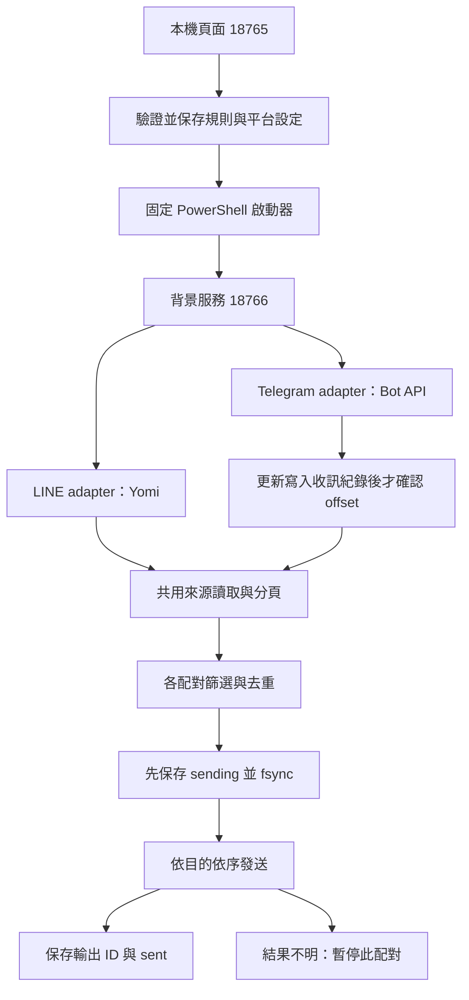

# 運作原理

v0.3.0 將聊天室讀取與轉送規則分開。LINE 使用 Yomi 的非官方個人帳號協定；Telegram 使用官方 Bot API 的長輪詢。兩者轉為統一文字訊息，再由各規則處理。

## 服務與介面

18765 管理登入、規則、Telegram 設定與 LINE 預覽；18766 是獨立背景程序，關閉網頁不停止。啟動器驗證版本 3、設定摘要與就緒狀態，避免沿用其他規則。修改設定前必須停止。

LINE 來源／目的限定已加入的一般群組及好友，不支援 OpenChat。Telegram 使用 Bot 身分，不登入使用者的個人帳號。目的文字由 LINE 帳號或 Bot 重新發送，不保留原發訊者身分。

## 規則與識別

每條規則保存穩定 ID，包含多個來源、目的、關鍵字與前綴。所有來源乘以所有目的形成獨立配對。以平台與聊天室 ID 辨識，不依名稱定位。

配對紀錄識別包含規則 ID、兩端帳號身分與來源／目的 ID。改名稱沿用同一紀錄；新增規則或更換端點／帳號採新識別與基準。舊版按名稱建立的單配對紀錄不自動遷移。

啟用規則驗證重複邊與有向循環，阻擋 A → B → A；自己成功送出的訊息 ID 另存至輸出紀錄，避免它在下游來源再次轉送。這不會識別其他帳號或外部工具重新貼上的相同文字。

## 來源讀取與首次基準

首次讀取快照內的歷史 ID 與基準時間一次保存並同步到磁碟，不發送；重啟載入基準與既有已處理 ID。首次快照期間出現的文字若已在快照內，也略過。

同一 LINE 來源每輪只讀一次，供全部配對共用。最近 50 則不足時，利用公開的前一頁介面繼續查詢，最多 20 頁／1,000 則。查到各配對共用的已處理位置、舊於基準或資料結束才停；游標不前進、缺少游標或超過上限會報錯，避免悄悄截斷。

Telegram 由獨立長輪詢讀取更新。只保存選定來源的非 Bot、非保護文字；其他更新也保存處理位置。每筆紀錄 fsync 成功後才能推進 offset，下次 getUpdates 才確認前批更新。重啟可讀取已保存但尚未處理的文字。檔案損壞、寫入失敗或選定文字達 50,000 則時停止讀取，不自動刪資料。

來源讀取錯誤採 3、6、12、24、48、60 秒退避；其他來源仍繼續。Telegram 網路讀取次數與時間來自真正 getUpdates 成功，不把反覆讀快取計成成功輪詢。

## 各配對發送與故障隔離

文字通過時間、內容保護、ID 去重與關鍵字條件後，以時間由舊到新排序：

1. 保存 sending、fsync 並加入已處理集合。
2. 透過目的 adapter 發送純文字。
3. 回應必須含訊息 ID。
4. 保存目的輸出 ID 與 sent，fsync 完成後才增加成功數。

不同目的可並行；同一目的跨來源依序發送，間隔至少 1.1 秒。每輪完成後等待 3 秒，來源錯誤另採退避，不重疊執行下一輪。

逾時、錯誤或缺少回應 ID 均視為結果不明，保存 uncertain，暫停該配對。若重啟發現 sending 未完成或 uncertain，保持 blocked，不自動重試；其他配對可繼續。任何必要紀錄寫入失敗也停止相關配對。

| 情況 | 行為 |
| --- | --- |
| 相同文字不同 ID | 分別處理 |
| 沒有可讀文字／解密失敗 | 不發送；顯示來源診斷 |
| 更改關鍵字 | 不會把已略過或已處理的文字全部重算 |
| 重啟同一規則 | 沿用紀錄，補處理仍可查詢或已保存的新文字 |
| 新增規則 | 首次建立新基準，略過當時歷史 |
| 發送結果不明 | 跨重啟持續暫停，人工核對，不自動重送 |
| 一個目的初始化或發送失敗 | 隔離該配對，其他可運作配對繼續 |

## 保存與限制

規則與 Telegram 設定採寫入臨時檔、fsync、原子更名。配對、輸出與收訊使用追加 JSONL；載入時拒絕損壞與不完整末行。Windows 資料目錄只授權目前使用者與 SYSTEM，但內容未加密。

LINE 紀錄不保存來源全文；Telegram 為在確認更新前持久保存，會保存選定來源的文字。日誌及去重集合持續增長，尚無安全輪替、多程序交易保護與完整送達保證。請勿啟動多份相同資料目錄的登入／轉送流程。

成功數表示平台回應與本機結果保存成功，不是接收者已讀，也未逐則讀回驗證。[安全說明](../SECURITY.md) · [驗證紀錄](../yomi-probe/VERIFICATION.md)

[早期單配對互動示範](flow.html) 保留作歷史參考，不代表目前多規則架構。
